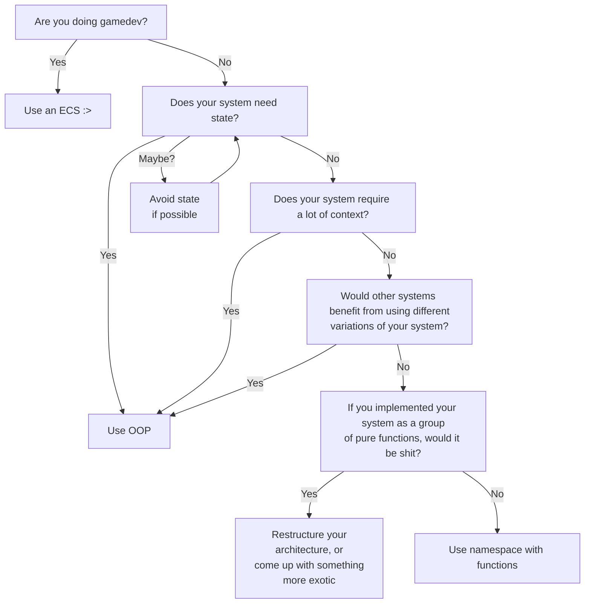

# OOP vs Else

<!-- truncate -->

## `SHOULD_I_USE_OOP.jpeg`

```mermaid
flowchart TD

O[Use OOP]

A[Are you doing gamedev?]
B[Use an ECS :>]
C[Does your system need state?]
D[Does your system require a lot of context?]
E[Would other systems benefit from using different<br/>variations of your system?]
F[If you implemented your system as a group<br/>of pure functions, would it be shit?]

God[Restructure your<br/>architecture, or<br/>come up with something<br/>more exotic]

Nice[Use namespace with functions]


A --Yes--> B
A --No --> C

C --Yes--> O
C --No --> D

D --Yes--> O
D --No --> E

E --Yes--> O
E --No --> F

F --Yes--> God
F --No --> Nice

C -- Maybe? --> State[Avoid state<br/>if possible]

State --> C


```

----------

 

(Please don't take this seriously)
