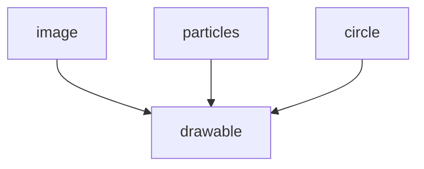

What is component-projection in Untitled Mod Game?

<!--truncate-->

"Component-projection" is a special feature that I use for my ECS in UMG.

It's extremely similar to inheritance in OOP; except, it occurs on components, as opposed to objects.

At it's most basic level, component-projection is when one component forces another component to exist.

Example:  
Lets say we have a generic `drawable` component, that is attached to any entity that is drawable.  

With this, we could have a few different components: 
```lua
-- all things that can be drawn!
ent.image = "monkey.png"
ent.particles = Particles()
ent.circle = {radius=5}
```
With component-projection, we would have each of these components "project" to the drawable component:


How this works in practice, is that entities are automatically granted a `drawable` component IF they have ANY of the listed components.

So when you do this:
```lua
ent.image = "bat.png"
```
It's effectively the same as doing:
```lua
ent.image = "bat.png"
ent.drawable = true
```

---

Whats AWESOME about this, is that we can now query entities without knowing about their particular implementation.  
(This probably smells very similar to OOP; yes.. it is.)  
For example:
```lua
-- Draw System (pseudocode)
local drawGroup = umg.group("drawable", "x", "y")

umg.on("@draw", function() {
    -- draw all entities!
    for ent in drawGroup {
        drawEntity(ent)
    }
})
```

And internally, `drawEntity` would emit some event through some [event bus](../buses), like this:
```lua
function drawEntity(ent) {
    -- dispatch `drawEntity` event
    umg.call("drawEntity", ent)
}
```

```lua
-- Other systems listen for `drawEntity` event:
umg.on("drawEntity", function(ent) {
    if ent.circle then
        drawCircle(ent.x, ent.y, ent.circle)
    end
})

umg.on("drawEntity", function(ent) {
    if ent.image then
        drawImage(ent.x, ent.y, ent.image)
    end
})
```

What's also amazing about this setup, is that entities can have ALL of the above components, and they will work perfectly fine.<br/>
Is that not beautiful?

---

## Taking it a step further- Values-projection:
We can take it a step further, by providing *values* for the projected component.  
Example:
```lua
components.project("nametag", "text", function(ent)
    local nametag = ent.nametag
    return {
        scale = SCALE,
        default = DEFAULT,
        component = "controller",
        oy = nametag.oy or EXTRA_OY,
        background = BACKGROUND_COLOR,
        disableScaling = true
    }
end)
```
Here is a code snippet yoinked straight from the ecosystem.  
In this example, the `nametag` component "passes" a bunch of default values to the `text` component; most notably, it tells the text component to take the value of the `controller` component; (which, notably, will be the username of the player.)


