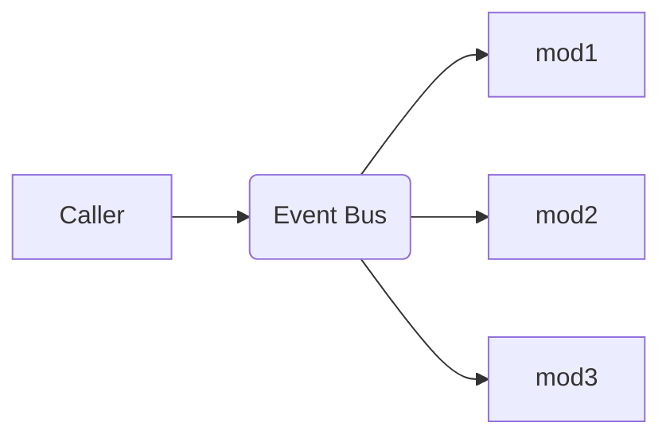
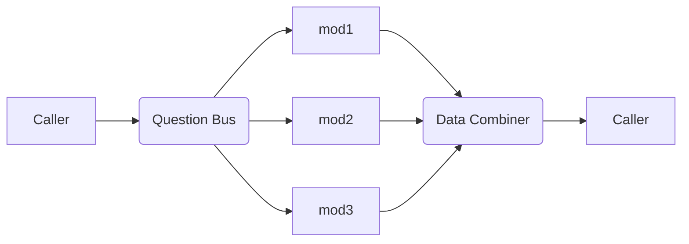
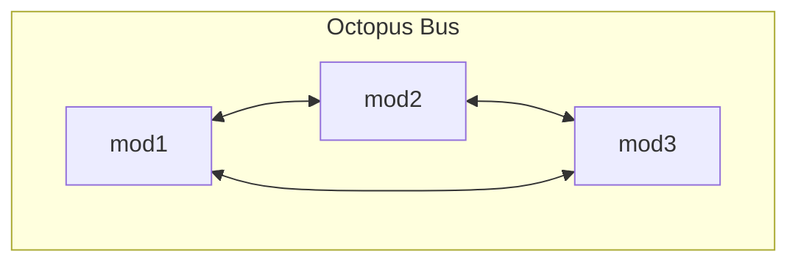
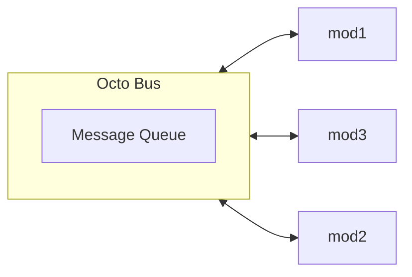
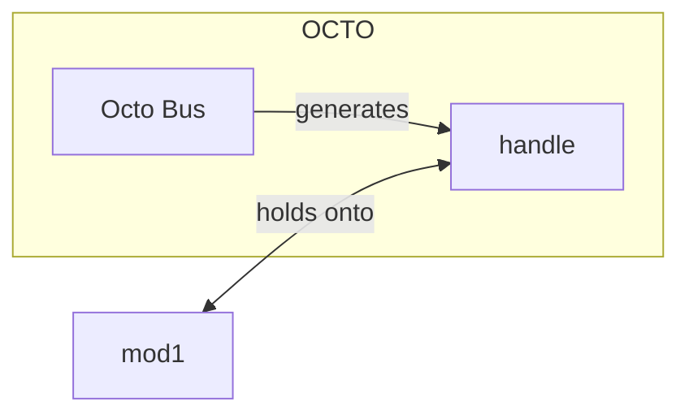

As of (3/04/2024), the date of writing this post, I have literally nothing to write about.  
All I have, is a "problem".

<!--truncate-->

Before we jump into what this problem is, I'm going to quickly recap on what the purpose of [question-buses and event-buses](./2023-05-10_question_buses.md) are.

---
<br/>

### Event bus:
- Dispatches information to multiple sources cleanly
- `1 --> Many`

### Question bus:
- Gathers information from multiple competing sources cleanly
- (Resolves conflicts via a commutative "combiner" function)
- `1 --> Many --> 1`

<br/>

I use these things *all* the time, and there's no doubt that they are amazing.  
But, they do have some caveats / limitations.   
I'm hoping that if I create a different data-structure to fix some of these limitations, the ecosystem could become a whole lot cleaner.  
Anyways, lets dive into the issues:

---

**No control flow access:**  
If we receive an event from the event-bus, that event has already happened. We cannot prevent the event from happening retroactively.  
This means we have no access to the control-flow.  
(This is also a benefit somewhat, as it provides implicit decoupling)  
(ANOTHER NOTE: It's a common idiom in UMG to use question-buses to tap into the control-flow of something; which remedies this problem a bit)

**Inefficiencies:**  
If we are looping over 10 listeners every time we emit an event or ask a question, but only 1/4 of the listeners actually wants to respond, then we are wasting a whole load of compute.  
(This isn't a *too* big of a deal, but its still a big-ish downside)


**Lack of control over WHO listens:**  
But by far the biggest "caveat", IMO, is the lack of insight into WHO is handling the event.  
By nature, we don't *care* how many mods are listening to our question/event. Maybe 10 other mods are listening. Maybe none are! Who cares!  
This is an amazing feature, because it provides **amazing** decoupling...  
but as a sacrifice, it misses some features:

- Can't pass one-time-use objects, since there are multiple listeners
    - (For example, a volatile callback)
- Allowing other systems to control WHO is listening
    - For example, a system turns off, and resigns control
- Allowing listeners to coordinate/communicate with each other somehow
    - EG: "Yo, I'll answer this question, you guys stay away"
    - (^^^ note, this is *kinda* solved with `combiner` funcs)


# Ok. Lets do some planning.
Please remember; I'm still completely spitballing at this point.  
I'm still not sure if there is a valid solution here; and [the problem isn't well-defined either.](./2023-10-28_problem_solving.md)

Ok. Lets list out the current data flows for buses, and then lets see if we can create a structure that reinterprets the data-flow.

---




---




---

<br/>

# LETS DO SOME YOLO COOKING:
Behold, the "octopus-bus":


^^^ Ok, so straight away, the big issue with this, is that these mods have no way to communicate with each other. They have no idea what the purpose of each other is. So this setup is pretty stupid.

---
Is there a way we can reinvent the octopus bus with a well-defined communication protocol between the mods?  
What if we put the octopus in the middle? Have it act as a "medium" of information transfer...?


Okaayy.... this feels awfully similar to a [love2d channel](https://love2d.org/wiki/Channel).  
The idea, is that the Octo-bus would allow mods to push/pop messages with predefined formats, and then mods could read the messages at their whim.   
But remember! We actually have a super-weapon here: There will only ever be ONE mod interacting with the Octo-bus at a single point in time.  
This means we have great power over the control-flow, since only 1 mod will interact with something at once.

This also kinds reminds me of mutexes/locks.

Perhaps a message-queue isn't the right idea here; we should instead let the modder define what type of data-structure is at the focal-point. Perhaps its just a singular number!

# Ok, lets brainstorm some actions:

- Notify members of change of data (ehh, kinda similar to evbus)
- Claim data as own
- Pop/push data, modifying it
- Query for the mod that pushed the data
- Query for a mod that has consumed some data(...?)
- Send private-message to a mod
- Ignore messages from another mod
- Examine the state of other mods (within the octo-bus context)
- See how many other mods are active within the octobus

^^^ Remember, all of these are just spitballing ideas.

## MASSIVE DOWNSIDE:
Octo-buses are *stateful.* The beauty of evbuses and qbuses, is that they are completely stateless.

Is there a way we can have the benefits of Octo-buses, (ie multi-way-communication,) without being stateful...?  
Ok.. hmm, in order for something to be stateless, it's operations must happen instantly/atomically.

Also, I'd like to point out; being stateful isn't entirely bad. There is such thing as "good state", and "bad state".  
For example, in this context, "good state" would be state where the *mods themselves* hold the state; and no state is held in the octo-bus.    
Therefore, all of the "yucky statefulness" is held local to each system; and there is no weird, mystical global state that exists.

Spitball: Perhaps an object/handle is obtained whenever an object interacts with an octo-bus...?



`mod1` could then examine the handle, and communicate with other mods with it.  
For example: 
- "Who took my data? Im gonna send them a follow-up message."

---

<br/>
<br/>

Ok. Lets take a step back, and take a look at a *real* situation where we are feeling some pain-points.

Control-flow looks like this:

```lua
-- `money` mod
local function setMoney(val)
    --... do something
    abstractSetMoney(val)
    -- ... do something else
end
```
In this example, we want `abstractSetMoney()` to be a singular function from a future mod;  yet, we aren't sure what that mod is, and what it looks like.
We also want ONLY ONE mod to handle it, because we don't want to duplicate money.

Now, there are some "simple / hacky" solutions that already exist for this:
- expose an overridable field:
```lua
-- `money` mod
local function setMoney(val)
    --... do something
    money.abstractSetMoney(val)
    -- ... do something else
end
```
```lua
-- cities mod:
-- Overrides `money.abstractSetMoney`
function money.abstractSetMoney(val)
    local bank = cities:getBank()
    bank:setMoney(val)
end
```
The reason this kinda sucks, is because another mod could come and override it; and suddenly, our banks don't work! Darnit!

It's a bit of a cursed contradiction, really; we only want one mod to handle it, but we dont want mods to step on each other's toes.  
If only they could communicate and come to an agreement somehow....

^^^ Also, another reason why I kindof dislike the above method, is because it's not *standardized.* It feels really weird overridding some random mod's API.

--- 

## Idea: Entity-methods.
Instead of using some abstract, static data-structure to propagate information, simply rely on the entities having methods.  
So in this case:
```lua
local function setMoney(val)
    local worldEnt = getWorldEntity() 
    -- gets the entity that represents the world
    worldEnt:setMoney(val)
end
```
Downside/issue with this approach:  
We need a way to guarantee that an ent actually HAS the required methods.

Cool idea:


