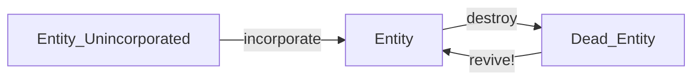

Bunch of lessons and yapping after 3 years of working on UMG-engine.

<!--truncate-->

# MAIN LESSONS:

## Flexibility is not important; prioritize good assumptions instead.
When I started, a core goal of UMG was "flexibility".  
I changed my mind on this, and now, I think that a more practical goal is to have high cohesion between mods instead.  

When writing code, you can never write code that accounts for everyone's use case. That's just not realistic.

A much better goal, is to prioritize making good assumptions about stuff instead.  
Be diligant, don't be scared to draw a hard line.   

For example, in minecraft, a good assumption is that you can't place blocks that are midway between 2 positions.  
This limitation provides excellent utility to minecraft's systems; it allows everything to be way more efficient, well-defined, and robust, AND it doesn't harm the integrity of the game at all.  
In fact, quite the opposite! it's what minecraft is known as.  

In general, our goal should be to create excellent *assumptions* about systems, rather than trying to shoehorn in a one-size-fits-all approach that just ends up getting nowhere, and doing nothing useful.

---

<br/>
<br/>

## Limitations are good

At face value, limitations sound objectively bad.  
But, like with many things, there is always nuance:

If a system has more limitations, then we can reason about it more effectively.  
Simple example: `foo variable is a number` 
^^^ This is a big limitation. But this "limitation" gives us great value.  
What value do we get? Lets see!
```
[foo is a number]
- we can add,subtract,multiply,divide by foo
- we can plug it into functions
- we can set the value of it robustly
- DOWNSIDE: we cant represent more exotic types in foo

[foo is any type]
- It's flexible
- DOWNSIDE: We lose ALL of the above benefits
```
This is a kinda weird/contrived example, but it demonstrats the idea.  
Limitations can be good, when chosen well!! It's all about *execution.*

- Good limitation, is *very good*.
- Bad limitation, is VERY, VERY BAD.

### EXAMPLE: Revival vs NO Revival of entitis:



At a glance, it may seem like these two setups are pretty much identical.  

BUT **NO!!!** The second one has a hard limitation: "Dead entities will NEVER be revived."  
This limitation gives us *so much more power.*  

Now, systems that receive a dead-entity can be 100% sure that it will never exist again. So, they can dispose of it happily.  
The server doesn't need to worry about syncing, and systems that have a hold on the entity-id can happily recycle the ent-id for other stuff.

Limitations can often provide good value.  
What's really important is choosing the *right* limitations, and not putting limits on stuff if there is no clear gain.

---

<br/>
<br/>


## Simplicity is paramount
This goes without saying.  
The less moving parts, the better.  
Try to plan ahead. Try to make each part of the system do one SMALL thing.

"But what if we need a complex feature??"   
That's fine; wrap simple-bits in more complex wrappers.  
Reuse the complex wrappers whereever you want.

---

<br/>
<br/>

## Explicit > Implicit
The engine shouldn't do stuff under the hood.  
In legacy-umg, we synced entities automatically.  
We buffered entities to the ECS automatically.  
We added entities to groups automatically after creation.   

Implicit code is bad, because it can restrict what the programmers can do,
and it makes it so some code ends up being written as a "hack" around the implicit systems that exist.

Next time, make stuff explicit please.

---

<br/>
<br/>

## Load-time validation is great
We should attempt to verify as much stuff as possible at load time.
Whether that be name-conflicts, data-integrity issues, or misuse of APIs.

Good example:  
We should have a new function: `umg.defineComponent(compName)`  
If two mods try to define the same component, we should throw an error.

Likewise, if a mod tries to define a non-existant shcomp on an entity,
then we also should throw an error

---

<br/>
<br/>

## Enable Entity-specific behaviour!
Pure-ECS has no entity-specific behaviour. 
(This is in contrast to OOP, where functions can exist on objects, and be completely custom)  
And I think in general; this is still a good ideology.  
But in reality, sometimes we just *need* entity-specific shit.  
The `onActivate` function shcomp in lootplot was a complete GODSEND.  
We need more of that for future versions. It was just amazing, really.

In future, put more thought into how we can allow for better function-shcomps in the future.


---

<br/>
<br/>

## Custom entity data structures
`group:onAdded(func)` was amazing, since it provided us with custom data-structures to store entities in.  
More of this please. I think we can do a bit better, too.   
Maybe create a helper-wrapper?  
```lua
function newEntityGrid(components...)
    local g = umg.group(...)
    local grid = Grid()

    g:onAdded(function(ent)
        grid:add(ent)
    end)
    g:onRemoved(function(ent)
        grid:remove(ent)
    end)

    return grid
end

local myGrid = newEntityGrid("fire", "burnable")
```
More importantly, tho, we should aim to provide better features to enable this sort of flexible programming.  
Maybe something to do with archetypes in the future?


---

<br/>
<br/>
<br/>
<br/>
<br/>
<br/>


---

# Things that worked really well in UMG:

## GOOD MOD STUFF:
- `sync.proxyEventToClient` this was amazing, simple, and super helpful
- `sync.autoSyncComponent` for simple components, this was amazing
- `typecheck` mod was DAMN AWESOME.
- `onActivate` component (and in general, function shcomps) were great
- wrapping `umg.defineEntityType` was super cool. (eg `defineFood`)
- assumptionless mods (like `generation` mod) were great because they provided implicit DELS

<br/>

## GOOD UMG-API STUFF:
- evbuses, qbuses were epic (kinda)

I was a bit unhappy with how events/questions were defined.
I would like strong-type-lints in the next version, maybe.  
Something like:
```lua
local e = Event()

e:call(1,2,3)

e:on(function(x,y,z)
    -- do stuff
end)
```
^^^ this would allow LuaLS to work.   
Do the same for questions.


