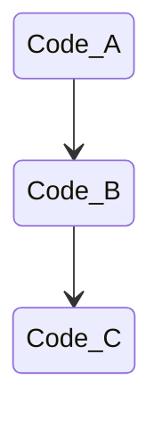
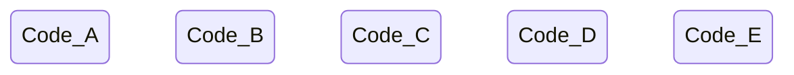

Bunch of lessons and yapping after 3 years of working on UMG-engine.

<!--truncate-->


# Throughout this post, I will list a bunch of the core "lessons" I have learned from 3 years of UMG, condensed into 1 file.

---

<br/>
<br/>

## Pragmatism over Dogmatism.
Favor practicality/pragmatism over ideology/dogmatism.  
**^^^ Possibly the most important programming lesson I have ever learned.** 

This sounds obvious, but it took far me too long to learn.

Sometimes, dogmatism can be useful, since our brain can ignore entire classes of ideas/solutions without analyzing them. (Ideas that don't align with our ideology.) This ignorance allows our brain to focus on more important stuff, which can be helpful.  

In engineering though, being blind is not a good thing.  
It's easy to be dogmatic, less easy to be pragmatic.  

**To sum it up: Instead of being dogmatic, be pragmatic.**   
Be open to new ideas! Execution is everything.

---

<br/>
<br/>


## Simplicity is paramount

Simplicity is hard. Making something complex while having everything look simple is a monumental task.  
It is very, very easy to just throw a bunch of code together and make a mess doing something.  
Be disciplined! Do NOT give in to the temptation of easy complexity. 


---

<br/>
<br/>


## Avoid premature abstraction/generalization

Don't overfocus on making your components and systems as generic as possible.  
Instead, make them useful for the current problem.  
The more generic or abstract something is, the harder it is to work with.  

The faster you can get "strong rules" down for your systems, the easier development will be.  

Basically, we want to avoid making things overly generic;   
Instead, we should make HARD, SIMPLE assumptions about stuff. (Perfect example of this is minecraft, with its voxel-like setup)  
If the assumption is strong and fits our use case, the systems will end up being more powerful and simpler anyway.

It's honestly OKAY if we don't hit all use-cases.

Likewise, avoid blindly following DRY principle. (The [AHA principle states exactly this.](https://en.wikipedia.org/wiki/Don%27t_repeat_yourself#AHA))


---

<br/>
<br/>


## Coupling vs Abstraction
When writing code, try to be aware of all the coupling that you introduce.  
Coupling is invisible when writing code, but very much visible when refactoring.

[This video explains it nicely.](https://www.youtube.com/watch?v=rQlMtztiAoA&ab_channel=CodeAesthetic)

If functions are the same, but have different reasons to change, they do not belong under the same abstraction.

Copy-pasting code is not always bad!!

---

<br/>
<br/>

## Little helper functions

If you find yourself copy-pasting similar code a bunch, just make a little helper function to automate it.  

Don't be tempted to make a big, overreaching abstraction at a higher level. Just make a cute lil helper instead.

Also, don't be afraid to just copy-paste the helper function to the top of whatever file you are using it in!  
(The perfect example here is item-definitions for lootplot; where little-helper functions are super useful)

```
If the helper-func's purpose is well-defined, and simple:  
Maybe best to share it between files

If the helper-func's purpose is ill-defined, or may change:  
Maybe best to copy paste it to the top of the file?
(Reduces coupling; avoids potential refactors)
```

Either way, dont be dogmatic, be pragmatic.

---

<br/>
<br/>


## Big files

Don't be afraid of big files (ie files that are over 1000 lines long.)  
Never split up a big file just because "it's big".   
It should only be split up if it makes logical sense.  

(Perfect example of this is `lootplot/shared/exports.lua`; it's really nice having all of the exports in one place.)  
(Another example is `s0.content/../foods.lua`, containing all the food-item definitions. It's nice to define all the foods in the same place)

This applies especially to big files that are broad; not deep. (see below)

---

<br/>
<br/>

## Prefer breadth, not depth

What's better?

---

### Depth:


---

### Or Breadth:


---

I hold that that breadth is generally always better.  

It's simpler.  
Each part is easier to understand.  
There is less coupling (ie: easier to refactor)  
Also easier to test


---

<br/>
<br/>


## SSOTs are great (But beware of SSOT/coupling tradeoff)
If we have data as a SSOT, there is less opportunity for bugs.  
There are less moving parts, and the system is more robust.

One downside:  
Having a SSOT *does* introduce coupling, since the parts must be connected.

So just be wary of this. Be pragmatic.

---

<br/>
<br/>


## Robust/defensive code is good

Being overly defensive is better than being overly aggressive.

Example:
```lua
onItemUsed(function(playerEnt, itemEnt)
    -- items always have a `mana` cost, 
    -- since we are making a game with wizards!
    playerEnt.mana -= itemEnt.manaCost
end
```
^^^ BAD!! This is terrible!!!  
What happens if we add an item that doesn't use mana? (EG a gun???)  
Also, what happens if the player doesn't have mana???   
(SPOILER: game crashes)

```lua
onItemUsed(function(playerEnt, itemEnt)
    if itemEnt.manaCost and playerEnt.mana then
        -- avoids crash by checking defensively
        playerEnt.mana -= itemEnt.manaCost
    end
end
```

^^^ this code is much more robust, and much more defensive.

---

<br/>
<br/>

## Explicit > Implicit
The engine shouldn't do stuff under the hood.  
In legacy-umg, we synced entities automatically.  
We buffered entities to the ECS automatically.  
We added entities to groups automatically after creation.   

Implicit code is bad, because it can restrict what the programmers can do,
and it makes it so some code ends up being written as a "hack" around the implicit systems that exist.

It's also makes the system harder to reason about as a whole.

Next time, make stuff explicit please.

---

<br/>
<br/>

## Load-time validation is great
We should attempt to verify as much stuff as possible at load time.
Whether that be name-conflicts, data-integrity issues, or misuse of APIs.

Good example:  
We should have a new function: `umg.defineComponent(compName)`  
If two mods try to define the same component, we should throw an error.

Likewise, if a mod tries to define a non-existant shcomp on an entity,
then we also should throw an error

---

<br/>
<br/>

## Hybrid OO-ECS works really well.
Pure-ECS has no entity-specific behaviour. Entities cannot contain functions in pure-ECS, they can only contain data.
(This is in contrast to OOP, where functions can exist on objects, and be completely custom)  

In reality, sometimes we just *need* entity-specific shit.  
The `onActivate` function shcomp in lootplot was a complete GODSEND.  
We need more of that for future versions. It was just amazing, really.

In future, put more thought into how we can allow for better function-shcomps in the future.


---

<br/>
<br/>

## Custom entity data structures
`group:onAdded(func)` was amazing, since it provided us with custom data-structures to store entities in.  
More of this please. I think we can do a bit better, too.   
Maybe create a helper-wrapper?  
```lua
function newEntityGrid(components...)
    local g = umg.group(...)
    local grid = Grid()

    g:onAdded(function(ent)
        grid:add(ent)
    end)
    g:onRemoved(function(ent)
        grid:remove(ent)
    end)

    return grid
end

local myGrid = newEntityGrid("fire", "burnable")
```
More importantly, tho, we should aim to provide better features to enable this sort of flexible programming.  
Maybe something to do with archetypes in the future?


---

<br/>
<br/>
<br/>
<br/>
<br/>
<br/>


---

# Things that worked really well in UMG:

## GOOD MOD STUFF:
- `sync.proxyEventToClient` this was amazing, simple, and super helpful
- `sync.autoSyncComponent` for simple components, this was amazing
- `typecheck` mod was DAMN AWESOME.
- `onActivate` component (and in general, function shcomps) were great
- wrapping `umg.defineEntityType` was super cool. (eg `defineFood`)

<br/>

## GOOD UMG-API STUFF:
- evbuses, qbuses were pretty good (kinda)

I was a bit unhappy with how events/questions were defined.
I would like strong-type-lints in the next version, maybe.  
Something like:
```lua
local call, on = Event()

call(1,2,3)

on(function(x,y,z)
    print("explosion!")
end)
```
^^^ this would allow LuaLS to work.  
Not only that, but we could also do more useful stuff:
```lua

local call, on = Event()
proxyEventToClient(call, on, "mod:event_id")

```
Do the same for questions.


## Lets talk about "flexibility."
When I started, a core goal of UMG was "flexibility".  
I changed my mind on this, and now, I think that a more practical goal is to have high cohesion between mods instead.  

When writing code, you can never write code that accounts for everyone's use case. That's just not realistic.  
I often found that, whilst trying to aim for great-flexibility, I would just end up making premature abstractions that ended up adding useless complexity to the system.  
"Oh, but it's flexible! Oh wow, it's so generic!!!"  
No. Shut up!  
We don't want complex abstractions. The more abstract something is, the harder it is to work with in a practical sense.

A much better goal, is to prioritize making good, simple assumptions about stuff instead.  

In general, our goal should be to create hard, well-defined *assumptions* about systems, rather than trying to shoehorn in a one-size-fits-all approach that just ends up getting nowhere, and doing nothing useful.

The new goal for UMG is to create maximum *cohesion* between mods.  
If modder-A and modder-B write mods, then both mods should ideally work with each other just fine.


## Hard limitations are good

At face value, limitations sound objectively bad.  
But, like with many things, there is always nuance:

If a system has more limitations, then we can reason about it more effectively.  
Simple example: `foo variable is a number` 
^^^ This is a big limitation. But this "limitation" gives us great value.  
What value do we get? Lets see!
```
[foo is a number]
- we can add,subtract,multiply,divide by foo
- we can plug it into functions
- we can set the value of it robustly
- DOWNSIDE: we cant represent more exotic types in foo

[foo is any type]
- It's flexible
- DOWNSIDE: We lose ALL of the above benefits
```
This is a kinda weird/contrived example, but it demonstrates the idea.  
Limitations can be good, when chosen well!! It's all about *execution.*

- Good limitation, is *very good*.
- Bad limitation, is VERY, VERY BAD.

**EXAMPLE: Revival vs NO Revival of entities:**


At a glance, it may seem like these two setups are pretty much identical.  

BUT **NO!!!** The second one has a hard limitation: "Dead entities will NEVER be revived."  
This limitation gives us *so much more power.*  

Systems that receive a dead-entity can be 100% sure that it will never exist again. So, they can dispose of it happily.  
The server doesn't need to worry about syncing, and systems that have a hold on the entity-id can happily recycle the ent-id for other stuff.

---

Another example:  
In minecraft, you can only have 1 block per (x,y,z) position.  
(IE, you cannot have blocks that are placed inbetween other blocks)   
This sounds bad, but it's not. It's actually very good!  
If there are more limitations, then our code can reason about stuff better:
- There don't need to be as many safety checks
- Our systems can be more sure of things
- We can make more powerful/strong assumptions

And best of all, the one-block per (x,y,z) position fits really well with the game; in fact, it even defines *what the game is.*

---

**TO SUM IT UP:**  
Limitations can often provide good value.  
What's really important is choosing the *right* limitations, and not putting limits on stuff if there is no clear gain.

---

<br/>
<br/>

