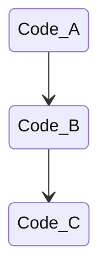
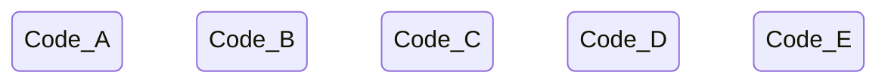

Bunch of lessons that I learned after 3 years of working on UMG-engine.

<!--truncate-->


# Throughout this post, I will list a bunch of the core "lessons" I have learned from 3 years of working on UMG, condensed into 1 file.


<br/>
<br/>

## Pragmatism over Dogmatism.
Favor practicality/pragmatism over ideology/dogmatism.  
**^^^ Possibly the most important programming lesson I have ever learned.** 

This sounds obvious, but it took far me too long to learn.

Sometimes, dogmatism can be useful, since our brain can ignore entire classes of ideas/solutions without analyzing them. (Ideas that don't align with our ideology.) This ignorance allows our brain to focus on more important stuff, which can be helpful.  

In engineering though, being blind is not a good thing.  
It's easy to be dogmatic, less easy to be pragmatic.  

**To sum it up: Instead of being dogmatic, be pragmatic.**   
Be open to new ideas! Execution is everything.

---

<br/>
<br/>


## Simplicity is paramount

Simplicity is hard. Making something complex while having everything look simple is a monumental task.  
It is very, very easy to just throw a bunch of code together and make a mess doing something.  
Be disciplined! Do NOT give in to the temptation of easy complexity. 


---

<br/>
<br/>


## Avoid premature abstraction/generalization

Don't overfocus on making your components and systems as generic as possible.  
Instead, make them useful for the current problem.  
The more generic or abstract something is, the harder it is to work with.  

The faster you can get "strong rules" down for your systems, the easier development will be.  

Basically, we want to avoid making things overly generic;   
Instead, we should make HARD, SIMPLE assumptions about stuff. (Perfect example of this is minecraft, with its voxel-like setup)  
If the assumption is strong and fits our use case, the systems will end up being more powerful and simpler anyway.

It's honestly OKAY if we don't hit all use-cases.

Likewise, avoid blindly following DRY principle. (The [AHA principle states exactly this.](https://en.wikipedia.org/wiki/Don%27t_repeat_yourself#AHA))


---

<br/>
<br/>


## Coupling vs Abstraction
When writing code, try to be aware of all the coupling that you introduce.  
Coupling is invisible when writing code, but very much visible when refactoring.

[This video explains it nicely.](https://www.youtube.com/watch?v=rQlMtztiAoA&ab_channel=CodeAesthetic)

If functions are the same, but have different reasons to change, they do not belong under the same abstraction.

Copy-pasting code is not always bad!!


---

<br/>
<br/>

## Explicit > Implicit
The engine shouldn't do stuff under the hood.  
In legacy-umg, we synced entities automatically.  
We buffered entities to the ECS automatically.  
We added entities to groups automatically after creation.   

Implicit code is bad, because it can restrict what the programmers can do,
and it makes it so some code ends up being written as a "hack" around the implicit systems that exist.

It's also makes the system harder to reason about as a whole.

Next time, make stuff explicit please.


---

<br/>
<br/>

## Little helper functions

If you find yourself copy-pasting similar code a bunch, just make a little helper function to automate it.  

Don't be tempted to make a big, overreaching abstraction at a higher level. Just make a cute lil helper instead.

Also, don't be afraid to just copy-paste the helper function to the top of whatever file you are using it in!  
(The perfect example here is item-definitions for lootplot; where little-helper functions are super useful)

```
If the helper-func's purpose is well-defined, and simple:  
Maybe best to share it between files

If the helper-func's purpose is ill-defined, or may change:  
Maybe best to copy paste it to the top of the file?
(Reduces coupling; avoids potential refactors)
```

Either way, dont be dogmatic, be pragmatic.

---

<br/>
<br/>


## Big files

Don't be afraid of big files (ie files that are over 1000 lines long.)  
Never split up a big file just because "it's big".   
It should only be split up if it makes logical sense.  

(Perfect example of this is `lootplot/shared/exports.lua`; it's really nice having all of the exports in one place.)  
(Another example is `s0.content/../foods.lua`, containing all the food-item definitions. It's nice to define all the foods in the same place)

This applies especially to big files that are broad; not deep. (see below)

---

<br/>
<br/>

## Prefer breadth, not depth

What's better?

---

### Depth:


---

### Or Breadth:


---

I hold that that breadth is generally always better.  

It's simpler.  
Each part is easier to understand.  
There is less coupling (ie: easier to refactor)  


---

<br/>
<br/>


## SSOTs are great (But beware of SSOT/coupling tradeoff)
If we have data as a SSOT, there is less opportunity for bugs.  
There are less moving parts, and the system is more robust.

One downside:  
Having a SSOT *does* introduce coupling, since the parts must be connected.

So just be wary of this. Be pragmatic.

---

<br/>
<br/>


## Robust/defensive code is good

Being overly defensive is better than being overly aggressive.

Example:
```lua
onItemUsed(function(playerEnt, itemEnt)
    -- items always have a `mana` cost, 
    -- since we are making a game with wizards!
    playerEnt.mana -= itemEnt.manaCost
end
```
^^^ BAD!! This is terrible!!!  
What happens if we add an item that doesn't use mana? (EG a gun???)  
Also, what happens if the player doesn't have mana???   
(SPOILER: game crashes)

```lua
onItemUsed(function(playerEnt, itemEnt)
    if itemEnt.manaCost and playerEnt.mana then
        -- avoids crash by checking defensively
        playerEnt.mana -= itemEnt.manaCost
    end
end
```

^^^ this code is much more robust, and much more defensive.
