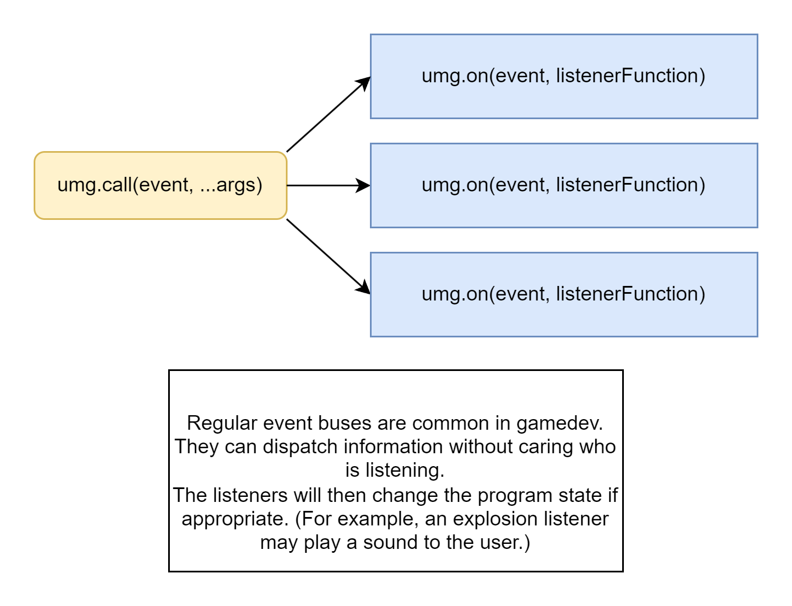

# Question buses in Untitled Mod Game

-------------------
## PRELUDE: 
*This reading requires a basic understanding of my vision for Untitled Mod Game:*<br/>
All you need to know is that there are two types of mods, "Base mods",
and "Playable mods."

- Base mods:
    - provide tools and infrastructure for modders to create content
    - do not provide any playable content

- Playable mods:
    - provide gameplay and content
----------------------


# Before we look at question buses, lets understand event buses.

Event bus diagram:



Event buses are an *awesome* tool in the context of Untitled Mod Game.

Whenever a significant action happens in a base mod, that base mod can simply
emit an event to tell other mods that something interesting happened.

What's beautiful, is that the base mod emitting the event doesn't care who's listening.
It just throws the event into the void; the systems that care about it will
tag into it. Perhaps no one is listening! Perhaps 10 other mods are listening.
The base mod doesn't care.

A good example of this is the `entityDeath` event.<br/>
This event is called automatically when an entity dies, and the entity is
passed in as the first argument, like so:
```lua
-- base mod
umg.call("entityDeath", ent)
```
If other systems want to listen to this event, they can use `umg.on`:
```lua
-- Meanwhile, in a completely different mod:
umg.on("entityDeath", function(ent)
    -- plays a death sound when an entity dies.
    if ent.deathSound then
        playSound(ent.deathSound)
    end
end)
```

Now, this stuff is pretty basic, and this is nothing new. Event buses are a common
pattern, especially in game development.

I could give examples of the entity emitting blood particles if it has the `meat` component,
or spawning a full-health copy of itself if it has the `secondLife` component, but that's not the point
of this post.


# The problem space:

Okay, so event buses are great for dispatching information when we are within an unknown context.

But sometimes we don't want to dispatch information.<br/>
Instead, we may want to *receive* information.

Behold, the holy *question bus*!!

(I think it's best explained if I give a problem statement, and an example.)

Lets imagine that we have a system for attacking entities.<br/>
This system needs to know if an entity can attack or not.<br/>
But it doesn't know what other mods are loaded! It also doesn't know the context of the game
outside of it's pure little abstract layer.

So, we turn to *question buses.*

-----------------------

With question buses, we have two functions: 
```lua
-- asks a question
umg.ask(question, reducer, ...)

-- answers a question
umg.answer(question, answerFunc)
```


`ask` is similar to `call`, in that it initiates the "interaction".
```lua
-- attack system
local reducer = operators.OR

local isAttackBlocked = umg.ask("isAttackBlocked", reducer, entity, targetEntity)
```
`reducer` is the reducer function; it reduces all the answers to one value
by repeatedly applying itself to the answers.<br/>
(By nature, the reducer needs to be associative and commutative,
So functions like `SUM` or `AND` would also work.)

------------------------

`answer` is similar to `on`, in that it responds to a question.<br/>
Instead of executing something, however, the `answer` should ideally be a pure
function that just returns a result. For example:
```lua
-- team handler system

umg.answer("isAttackBlocked", function(entity, targetEntity)
    if entity.team == targetEntity.team then
        -- the entities are in the same team, so the attack should be blocked.
        return true
    end
    return false
end)
```

We may also have another answer, e.g. inside the stun system:
```lua
umg.answer("isAttackBlocked", function(entity, targetEntity)
    if entity.stunned then
        -- entity is stunned, and cannot attack
        return true 
    end
    return false
end)
```

If either of these "answerers" return true, then the attack is blocked.

-----------------

Here's an image that hopefully clarifies the idea further:


-----------------

All in all, the pattern can be summarized simply as so:

- Regular event buses:
    - Dispatch information in an abstract manner
    - Doesn't care who is listening

- Question buses:
    - Gather information in an abstract manner
    - Doesn't care who gives the information

------------------

Now, just quickly, I want to recap on why this pattern is actually useful.
*Why wouldn't you just check if the entities are on the same team in the `attack` code, instead of asking?*

With this setup, the `attack` system doesn't *know* about the concept of teams.
In fact, the concept of "teams" may not even exist, depending on what mods are loaded!

The attack system is asking a question in an abstract manner, and getting different results
depending on the what mods are loaded.

This is the exact same thing as event buses, except we are receiving information instead
of dispatching information.

# Is this pattern useful enough to justify it's existance?

It's pretty obvious just from looking at this pattern to see how easily
it could be abused.<br/>
It's the same as normal event buses; powerful, yet easy to abuse.

So, given the abuse potential, is this pattern worth it?

**Yes**, I would say so.<br/>
Perhaps this pattern is not useful in other problem spaces, but in UMG where we
literally **NEED** a way to receive information unassumingly, question buses just... *chefs kiss.*

To demonstrate why, here are some other questions that could be asked:
```lua
umg.ask("canOpenInventory", OR, inventory, ent) -- whether an inventory can be opened by `ent`
umg.ask("isHidden", OR, ent) -- whether `ent` is hidden
umg.ask("canUseItem", OR ent, itemEnt) -- whether `ent` can use `itemEnt`
umg.ask("canRide", OR, ent, steedEnt) -- whether `ent` can ride `steedEnt`

-- a more interesting one:
umg.ask("getDamageMultiplier", MULTIPLICATION, ent, targetEnt)
-- returns the damage multiplier for `ent`.
-- Note that the reducer function is multiplication in this case.
-- This is because we are combining the damage multipliers from all answers.
```


# To conclude:
question buses are a cool concept! :)

Although they can probably be abused very easily, (same as event buses,)
they still provide a very useful pattern for my project.

Thanks for reading this opinion piece! I hope I opened your mind a bit.

- Oli

