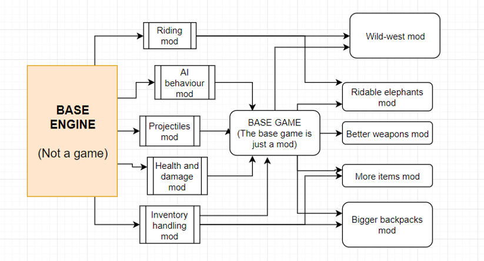

# Technical implementation details for UMG

<!--truncate-->

----------------------------

"Untitled Mod Game" (or "UMG" in short) is a multiplayer
game that is based on mods.

I've been developing it for many months at this point, and it's been really
fun!

It's setup is similar to that of Garrys Mod or Roblox;
where most playable content is User-generated.

------------------------------

However, UMG seeks to take things a bit further, and address
a few issues that exist with the traditional traditional modding approach.

**Traditional modding approach:**


-------------------

With UMG, we have two "types" of mods: "Base" and "Playable" mods.

- Base mods:
    - provide tools and infrastructure for modders to create content
    - do not provide any playable content

- Playable mods:
    - provide gameplay and content

What's interesting about this setup, is that there is no "game".
*Everything* is built as a mod.<br/>
Here's a diagram of what UMG would look like, under the same setup:



---------------

But, what's the point of this?<br/>
How is this any better than the former setup?<br/>

To explain the point of this, we need to understand what I call
"The Riding problem".

# The riding problem:

Lets imagine that we have 2 modders, "John" and "Mary".

Mary likes elephants, so she is making an elephant riding mod.
John likes horses, so he is making a mod where you can ride horses.

Both Mary and John go about their business, and create their mods.
Since there is no way for John and Mary to communicate, they both code
the riding behaviour independently.

This is *terrible*.<br/>
Why?  Well, the code for riding animals has been written twice independently.
Which is a big waste of time!

It would be much better if John and Mary's mods both "extended" a common mod,
e.g, the "Ridable Animals Mod".
This way, code is only written once in a generic fashion, and time is saved.

But actually, there's a bigger problem than "duplicate code": *Compatibility.*<br/>
Imagine if someone loads the ridable elephants mod, and the ridable horses mod at the same time.<br/>
Imagine the player jumps on a horse, and then goes over to an elephant,
and tries to ride the elephant *whilst riding* the horse.

At best, nothing happens.<br/>
At worst, the game crashes, or they get glitched across the world in an unpredictable fashion.

Without John and Mary following a standard protocol, there is no way for them
to know if they are breaking each others work.

-----------------------------

Ideally, in UMG, the "ridable" behaviour would be extrapolated to a "Base" mod.
The "Playable" mods, (ridable horses and ridable elephants) could then extend the "ridable" mod.

# Technical implementation:
So this setup is cool and all, but how would this work in a technical sense?<br/>
How do mods know about each other in this way?<br/>
Also, what stops other base mods from being incompatible with each other, causing the same class of problems?

To understand this, lets do a quick overview of UMG architecture:

## The UMG Entity Component System:
*If you have never heard of ECSes in a gamedev context, I recommend looking it up real quick.*


In UMG, everything in the world is an entity.
Players, bullets, enemies, trees, grass, are all entities.<br/>
Entities exist on both the server and the client; however only the server
has the authority to create and delete them.

A `Group` is like an array that holds entities. (<-- Remember this, it's important.)<br/>
Entities are automatically added to groups if they have the required components for that group.

```lua
-- Here's a group with components  .x, .y  .image  
-- All entities with these components are added to myGroup automatically.
local myGroup = umg.group("x", "y", "image")
```

Our "Systems" then will iterate over `group`s of entities,
executing code and changing the state of entities as they go.

So, back to the example from before. With the ridable horses and elephants.
With our setup, we could have both horses and elephants contain a `ridable`
component, and have a system act on all entities with `x, y, ridable` components.

```lua
local ridableGroup = umg.group("ridable", "x", "y")

local function update()
    for ent in ridableGroup do
        local riderEnt = ent.rider
        if riderEnt ~= nil then
            -- set the rider's position to the steed ent.
            riderEnt.x = ent.x
            riderEnt.y = ent.y
            riderEnt.z = ent.z + ent.ridable.rideHeight
        end
    end
end

-- Code for mounting.  This can be called by other mods, and is
-- called automatically when the player clicks on the steed.
local function mount(steedEnt, riderEnt)
    if not ridableGroup:has(steedEnt) then
        error("this entity isn't ridable!")
    end
    steedEnt.rider = riderEnt
end

... -- more code here, etc
```

I'd also like to point out that `riderEnt` does not neccessarily have to be a player.
In UMG, there's not really such thing as a "player"; a player is just a regular entity.<br/>
With this generic setup, we can have any entity type doing the riding. Which allows cool stuff such as:
- Enemies on horses
- Horses with chests on their back (chest entity is riding)
- Horses with lights on their back (torch entity is riding)
- Elephants with gun turrets on their back (turret entity is riding)

But anyway, that's getting sidetracked.<br/>
The main point of this is that now both the horse and the elephant can follow a
standard protocol for riding:
```lua
-- Horse entity
return {
  image = "horse",
  ridable = {
    rideHeight = 10
  },
  speed = 45
}
```

```lua
-- Elephant entity
return {
  image = "elephant",
  ridable = {
    rideHeight = 28
  },
  speed = 10
}
```

Awesome!  Now, John and Mary's mods work together just fine. 

-------------

Unfortunetely, Mary and John still have some problems that need to be addressed.

In John's horse riding mod, he wants to limit horse riding to the "knight" class.<br/>
In Mary's elephant riding mod, she wants the elephants to flap their ears when the player mounts.

But... how can this be solved?<br/>
Remember, the `riding` mod is a *base mod.*
Which means it knows NOTHING about the current game context; all it cares about is the `ridable` component.

So, the `riding` mod knows NOTHING about elephant ears.<br/>
It also knows NOTHING about "knights" either. The concept of "knights" may not even exist, depending on what mods are loaded!

## Mod communication through event buses:

To give Mary and John the tools to solve this problem, we can use [event-buses and question-buses.](./2023-05-10_question_buses)

Specifically, John and Mary need two things:
- Mary needs an event to be emitted whenever a ridable entity is mounted
- John needs to signal to the `riding` mod that horses can't be mounted unless the entity is of knight class

So, lets update our `mount` function from before:
```lua

local function mount(steedEnt, riderEnt)
    if not ridableGroup:has(steedEnt) then
        error("this entity isn't ridable!")
    end

    -- John needs to answer this question
    if umg.ask("ridingNotAllowed", OR, steedEnt, riderEnt) then
        return -- not allowed!
    end
    
    -- Mary needs this event
    umg.call("entityMounted", steedEnt, riderEnt)
    steedEnt.rider = riderEnt
end

```

Now, John and Mary can tag into these events, like so:
```lua
-- John's code:
umg.answer("ridingNotAllowed", function(steedEnt, riderEnt)
    if steedEnt.animalType == HORSE and riderEnt.class ~= KNIGHT then
        return true
    end
    return false
end)
```

```lua
-- Mary's code:
umg.on("entityMounted", function(steedEnt, riderEnt)
    if steedEnt.animalType == ELEPHANT then
        flapElephantEars(steedEnt)
    end
end)
```

Voila! Now, Mary and John can both have what they want, and
*what's best*, is that their code is still 100% compatible.<br/>
Isn't that beautiful?

This idea where mods are forced to be hyper-generic and hyper-compatible is a central goal of the UMG ecosystem.

Other mods may also tag onto this stuff, and it will be 100% fine,
since the `ridable` mod doesn't care (and doesn't even know) what mods are listening
to the events and answering the questions.

For example, maybe we want to have two teams, RED and BLUE.<br/>
This code makes it so only Blue team can use Blue horses, and same for Red:
```lua
-- Team system
umg.answer("ridingNotAllowed", function(steedEnt, riderEnt)
    if steedEnt.team and riderEnt.team and (steedEnt.team ~= riderEnt.team) then
        -- not in same team! disallow riding.
        return true
    end
    -- entities are either in same team, or don't have a team.
    return false 
end)
```

What's great, is that this code is 100% compatible with John and Mary's code from before.
It's just *beautiful*.


# Mod communication through components:

Events buses are not the only way mods can communicate.<br/>
Often, communication is done by simply changing component values from within entities.

Here's an example:

--------------------

Lets say we want our mod to render entities:
```lua
-- rendering system
local drawGroup = umg.group("image", "x", "y")

local function draw()
    -- this draw function is called every frame
    for ent in drawGroup do
        graphics.draw(ent.image, ent.x, ent.y)
    end
end
```
In this base mod, anything with an image, x, and y will be drawn to the screen.

To use this functionality, we can simply add the `x, y, image` components to one of our entities:
```lua
local ent = newEntity()

ent.x = 10
ent.y = 15
ent.image = "banana"
```
Now, this entity will be drawn to the screen automatically, at position (10, 15), with image "banana".

Awesome!<br/>
Okay, but what if we want an animation?

To handle animation, we can have another system that *changes* the `.image` component
with respect to time.<br/>
For example:
```lua
-- animation system
local animationGroup = umg.group("animation")

local function update()
    -- this function is called every frame
    local time = getTime()
    for ent in animationGroup do
        ent.image = getAnimationImage(ent.animation, time)
    end
end
```

What's cool, is that this animation code and the rendering code from before
can be in entirely different systems, or even in *entirely different mods.*

Here, the `animation` system is assuming that the rendering code will handle
the drawing of the entity, so all that it needs to care about is setting the image.

It's beautiful, right? :)


# To conclude:

This document gives a brief overview of some design challenges (and solutions) that the UMG ecosystem has to deal with.

I hope that the whole Base-mod / Playable-mod setup is a lot clearer, and I hope the
reasoning behind it makes sense now.<br/>
It's certainly a challenging and interesting project, and I absolutely wish to see it through.

Thanks for reading.
- Oli


