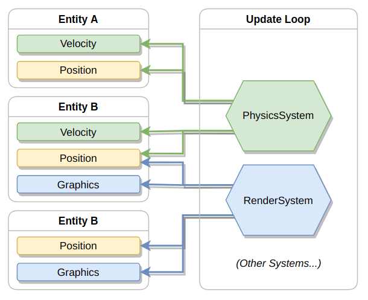

# Why should I use an Entity Component System?

ECSes are really cool and fun! This article will explain why I love them so much.

<!--truncate-->

If you drop an apple from an aeroplane, sooner or later, it will hit the ground,
and no longer be an apple.<br/>
And the same can be said about pears. And bananas. And most other objects,
for that matter.

The reason this happens is because of gravity.
Gravity is a rule that works on every object in the universe, which is how rules are supposed to work.

-----------


------------

In software development, it seems like a lot of rules aren't programmed this way.
With the rise of OOP, programmers have been fixated on binding behaviour to objects,
instead of binding behaviour to the system itself.

And in gamedev, this is something that has been challenged. (a lot.)
Classic Entity Component System (ECS) architecture goes as far to say that no behaviour
should be bound to game entities at all; they should only have data, and systems (rules)
should then act on that data in a global fashion.

To sum it up from a gamedev perspective:<br/>
- In classic OOP fashion, game entities contain functions. These functions define the behaviour of the entity.
- In classic pure ECS architecture, game entities are not allowed to contain functions. Behaviour is instead defined by "systems", which are external scripts that act on entities.


But hang on... what even is a component? Or an entity, or a system?


Concept	  | Explanation
----------|-----------
Component |	Plain old data with a name. Like a position, or an image
Entity    | A game object. E.g. an apple, truck, or human. Contains one or more components, grouped together. Does not contain code
System	  | Code that processes all entities with certain components




To better explain, I'll write a quick hacky example in pseudocode:

Entities / components:
```lua
-- an entity containing x, y, image components
local ent = {
    x = 5, -- `x` component
    y = 15, -- `y` component
    image = "cat" -- `image` component
}
```

Systems:
```lua
--[[
This is a view of entities that have all these components: (x, y, image)
(We don't care what other components the entity may have.)
]]
local drawEntities = entityGroup<x, y, image>()

function draw() {
    -- called whenever we draw to screen
    for ent in drawEntities {
        draw(ent.image, ent.x, ent.y)
    }
}
```


In this example, we create a global rule.<br/>
We say: for all entities that have `x, y, image` components,
we will draw these entities to the screen.

Similar to how gravity is applied globally to all objects,
we are applying our draw rule globally to all entities that fit the profile.

This allows us to create much more natural rules, which can give way for some nice emergence.
(I wrote another blog post on emergence, you should give it a read!)

However, the biggest benefit to ECS is not actually the "naturalness" of it;
rather, the biggest benefit is *scalability in design.*<br/>
We have applied a *global* rule to entities. And if you know anything about software
design, alarm bells should be going off right now. Generally, global state and
global behaviour is really bad, since it leaks out into the rest of the software and causes
a big mess.<br/>
But in this case, our global rule is not actually leaking anywhere.<br/>
It's entirely contained within the draw system. Isn't that beautiful?<br/>
When we go write a new system, we don't need to care AT ALL about this global rule we made.
The only thing we need to care about are the components. But that's completely fine,
because those entities were going to have those components anyway. Besides, there is no
funky behaviour tied up in the components; they are just data.

In fact, we can even create a new system, say, `AnimationSystem` that changes the `image` component
with respect to time to give entities an animation effect.
What's beautiful, is that the `AnimationSystem` *does not need to care* about the draw system at all.
The systems are effectively communicating through components.

And we don't stop there. We can keep scaling. We can keep adding as many systems, as many rules as we want,
and none of the systems will ever need to interact with each other.
And with every system we add, remember that the rules are applied *globally*.

And that's what I find so amazing about this setup. Each system is just fudging with data.
No system needs to know more than neccessary; there are no monolithic systems that know too much,
every system only takes the bare minimum, and outputs the bare minimum.
And we can afford to do the minimum, because our rules are applied globally; although are
rules may not be doing much on their own, if we add all our rules together, we get a big complex
system that is super easy to break down.

And that's it! I probably ranted for too long here, but you get the idea.<br/>
I see a lot of articles online praising ECS for it's cache performance benefits, and it's
ability to handle large swathes of entities. While this is true, I think what's more important is the
architectural side of it.
It allows us to handle massively complex systems whilst still being hyper-modular and hyper-generic.

-----------------

Before I end this blog post, I want to discuss what I use for my project.
Because I don't exactly use a pure ECS as it stands, but most of my ideas have been
adapted from the classic ECS setup:

## (Optional reading) What does UMG do?

Untitled Mod Game is a project I've been working on for a while.
UMG uses a "special" ECS setup.<br/>
I call it "special", because we break a few rules:

**RuleBreak 1:** in UMG, entities are typed. (Classic ECS has no types for entities)<br/>
**RuleBreak 2:** in UMG, entities can contain functions (OMG!!! EVIL!)<br/>

To visualize things, here is what an entity definition could look like in UMG:
```lua
-- a button entity that resets the board state when clicked

local resetButton = {
    image = "button1",

    buttonPressAnimation = {
        frames = {"button1", "button2", "button3"},
        time = 0.5
    },

    buttonPressSound = "click"

    onButtonPress = function(ent)
        board:reset()
    end
}
```

So, what's the reasoning behind breaking these two rules?

Rule 1 (entities having types) is broken partially for efficiency reasons.<br/>
With types, we can share static data across entities of the same type. 
It also means that redundant data doesn't need to be sent over the network.
All in all, it's just a bit nicer.[^1]


Rule 2 (entities containing functions) is broken for practical reasons.<br/>
In my opinion, practicality is ALWAYS more important than ideology.
Sure, in theory, it makes sense for entities to never contain functions.<br/>
But what about really niche cases? For example, what if I want to make a gun that clones entities when shot?<br/>
Well, let's try implement it!

We have a few options here:<br/>

**OPTION 1:** Hardcode the clone gun behaviour inside a system that only the clone gun uses.  (Bad, because we are creating a global rule that will only affect one entity type)<br/>
**OPTION 2:** Create a sophisticated command-template system. The clone gun can then use an on-hit clone command that's ran when the bullet hits an entity. (Better, but a blatant violation of YAGNI.)<br/>
**OPTION 3:** Hardcode the clone gun behaviour inside a function within the clone gun entity. (Violation of pure ECS principles, but other than that, the easiest solution)

Option 1 is obviously stupid, so lets just ignore it.

Lets look at what option 2 could look like:
```lua
-- clone gun entity:
local cloneGun = {
    gun = { bullets = 1, bulletSpeed = 200 },

    bulletHitEffect = {
        {effect = "clone", target = "target"}
    }
}


-- But remember, we also need a system to intercept the bullet behaviour:
-- bulletSystem.lua:

local effects = {
    ...
}
local targets = {
    ...
}

umg.on("entityCollide", function(e1, e2)
    if e1.bullet then 
        -- logic for applying the bullet hit effect here.
        ... -- apply effect enum to target
    end
end)


```


And now, the 3rd option:
```lua
-- clone gun entity:
local cloneGun = {
    gun = { bullets = 1, bulletSpeed = 200 },

    -- In this example, we put the cloning behaviour directly inside of the
    -- clone gun entity.
    -- This is a violation of ECS principles, because behaviour is supposed to be
    -- applied globally...     but it gets the job done.
    bulletHit = function(ent, bulletEnt, hitEnt)
        hitEnt:deepClone()
    end
}
```

In an ideal world, option 2 would be the best. 

But the world is not ideal. Us programmers have limited time.<br/>
And in the case of UMG, *modders* have limited patience.
Are people really going to want to create a whole new system just to clone an entity?<br/>
Hell nah! People probably just want to see themselves clone their buddies as fast as possible.

So therefore, UMG allows functions inside of entities.
Not because its good, but because I believe **practicality > ideology**.

Anyway, that's it for this blog post.

Thanks for reading this opinion piece!

- Oli


[^1]: (Quick note: In most ECSes, entities having no types is due to entities being represented as a single integer. From there, component data is packed into big cache-friendly PoD arrays that systems can zoom over and transform super quickly. UMG is using lua, which doesn't have the cache optimization opportunities that most low level languages have. Hence, entities being explicit types is not harmful to performance since we can't optimize for cache misses anyway lol! I just wanted to emphasize this, because I made it sound like entities being untyped came from an architectural standpoint, whereas it's rather mainly from a performance standpoint.)


