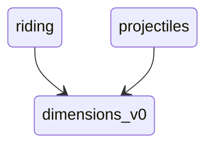
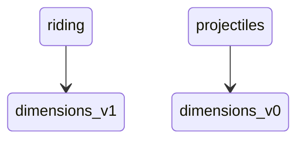
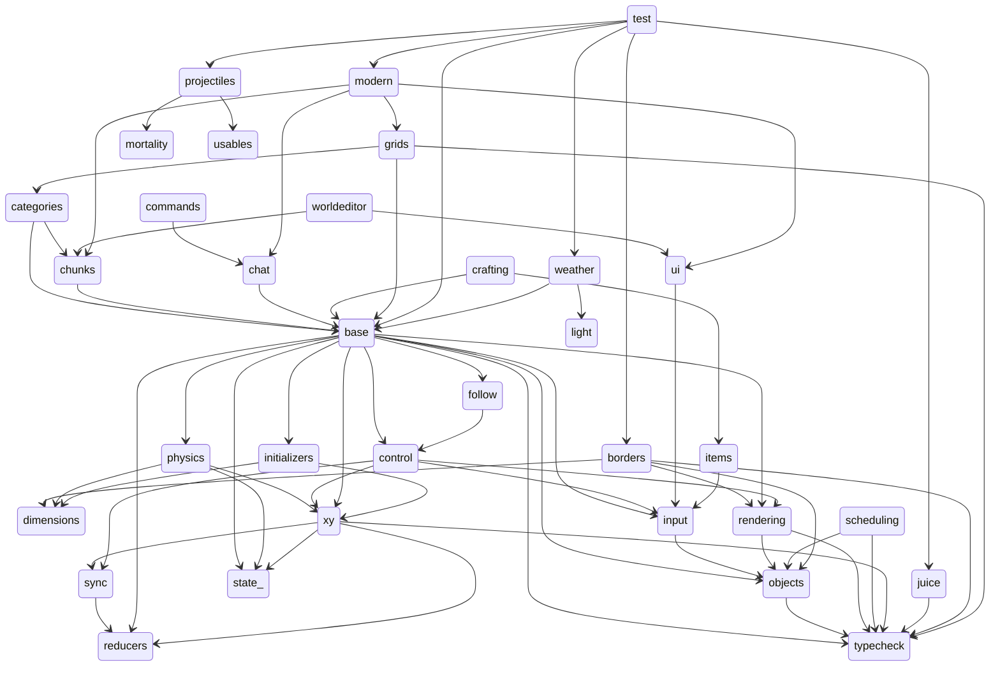

# Arguments for and against versioning

*(This article requires a basic understanding of my vision for Untitled Mod Game. If you are unfamiliar, [have a quick skim](UMG_Tech).)*

In Untitled Mod Game, there is going to be no versioning of mods. 
This is a very bold call, and it sounds stupid at face value.
But please, hear me out! 
This lil article will explain my thought process.

<!--truncate-->

---------------

In pretty much all software packaging systems, software has
version information. 
Versioning is great, because it allows introducing breaking changes to software without harming existing users.

And that's pretty much the main "point" of versioning, is dealing with breaking changes. 
If users don't want to deal with breaking changes, they can just stay on an older version.

Pros of versioning:
- Allows developers to break compatibility in favour of better features or removal of tech debt
- Users can use older versions if they want, granting a lot more freedom

Cons of versioning: (no major cons, really)
- Userbase can become fragmented

---------------

Now, before we start, I'd just like to note,
I'm **100% FOR** the use of versioning, and I think you'd have to be an idiot not to see the value in it for 99% of situations.

But UMG is a bit special in what it's trying to achieve. 
There's a very concerning situation where versioning could yield to a bit of a mess, I'll explain it below.

--------------------

Let's do a thought experiment, lets assume that mods ARE versioned in UMG.

As discussed in [my other article](UMG_Tech), a central goal of the UMG ecosystem is to ensure hyper-compatibility between mods.

I want to be able to load the `ridable` mod, and have it work fully with the `projectiles` mod. That way, I can ride my horse off into the sunset, weilding my minigun, and rocking a cowboy hat.

Ideally, the `projectiles` mod should not need to care about the `ridable` mod. In fact, both mods should not know about each other, since they are unrelated. 
However, both mods will still need to tag onto other mods.
Both the `projectiles` mod, and the `ridable` mod will need the `dimensions` mod to be loaded, so that they can fudge around with what dimensions steeds are in, and what dimensions projectiles are spawned in.

But lets assume that there was a breaking change in the `dimensions` mod, from version 0.0 to version 1.0, which overhauled the way entities are stored inside of dimensions, and changed a few things about the API.

Lets say that the `riding` mod updated to the latest version, but the author of the `projectiles` mod disagreed with the changes, so they stayed on the older version. 
Suddenly, we would have a setup like so:

Now, what fricken SUCKS, is that `riding` and `projectiles` are no longer compatible. 
Why? Because they use two different versions for the `dimensions` mod.
When entites are emplaced into a world, their `.dimension` component is going to be handled (and mangled) by two competing systems; one in `dimensions_v1`, and one in `dimensions_v0`. 
This is terrible.

Now, one could argue that this "issue" is the fault of whoever wrote the dimensions mod. 
And I would 100% agree. But that's kinda ignoring the real issue here. The real issue, is that this setup, (where `riding` and `projectiles` use different versions) is ALLOWED to exist.

The `riding` mod works fine on it's own. 
The `projectiles` mod works fine on it's own too! 

But what's bad, is that this setup will spread like a cancer. Any mods that build on top of `riding` will no longer be able to use the `projectiles` mod. Same vice versa. We have created a situation where our beautiful degree of hyper-compatibility is killed.

It would have been much better if whoever wrote `projectiles` was instead forced to use `dimensions_v1`; that way, compatibility between mods is guaranteed.

----------------

To hammer it home, here's a (simplified) version of the dependency tree for the existing UMG mod, `test`:

I simplified the diagram greatly, because the original was too cluttered and hard to read. (roughly half the edges have been omitted.)

Can you *imagine* what a nightmare this would be, if every mod was able to use it's own versions for stuff? 
It just wouldn't be possible. Versioning is not compatible with UMG's vision. 

But as stated previously... versioning IS useful, mainly for dealing with breaking changes. So how does UMG deal with breaking changes?

Well... it doesn't. 
Breaking changes will simply have to be avoided. To be fair, Java is a programming language [that has taken this exact approach](https://blog.jooq.org/the-lame-side-of-javas-backwards-compatibility/), and hey, they haven't done too poorly.

The main painstaking downside of this setup is that we are ASSUMING that the base mods are going to be developed in a forward thinking, robust manner. 
That is, developed free of future tech debt, and developed with all future requirements predicted for, (an impossible task.) 
Unfortunetely, I don't believe there is another solution. C'est la vie, brother!

