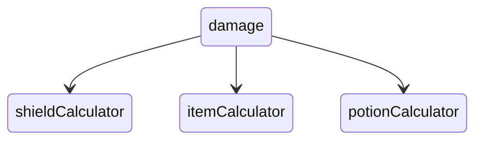
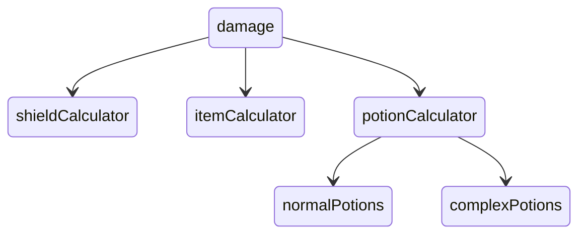

# How should we represent entity properties?

How should properties be represented in video games?<br/>
I.e, maxHealth, damage, speed?

<!--truncate-->

The naive approach is to directly mutate the value:
```lua
ent.damage = 5

-- If we want to increase/decrease damage, just add/subtract:
ent.damage += 5 -- increase 
ent.damage -= 5 -- decrease :) 
```

But this approach falls apart as soon as we add damage modifiers:
```
If ent inside circle
    gain 2 dmg
```
Suddenly, we have to increase/decrease `ent`s damage every time we enter/exit the circle.<br/>
And it gets a bit mucky... What happens if we have these two rules:
```
If ent inside circle
    gain 2 dmg

If ent inside square
    multiple dmg by 2
```
Now imagine the following events:
```
ent dmg = 5

ent enters circle (dmg = 5+2 = 7)
ent enters square (dmg = 7*2 = 14)
ent leaves circle (dmg = 14-2 = 12)
ent leaves square (dmg = 12/2 = 6)

ent dmg = 6
```
Uh oh!<br/>
Yeah we clearly need a smarter system.

# Ok. How should we do it then?

Lets create some ideas!

-----------

## Modifier list

IDEA: Have a list of `damageAdders` and `damageMultipliers` for our property.
```
ent dmgMultipliers = []
ent dmgAdders = []
```

This approach would involve having "modifiers" to the entity property, and when the entity's modifiers are changed, recalculate the property value.

Recall our circle/square example:
```
ent enters circle and square:
dmgMultipliers = [2] 
dmgAdders = [2] 
recalculation -> dmg = 14

ent exits:
dmgMultipliers = [] 
dmgAdders = [] 
recalculation -> dmg = 5
```

Now, TBH, I'm really not a fan of this solution...<br/>
Mainly because the damage modifiers have to be added AND THEN removed. If we forget to remove it, then we're screwed!<br/>
This is due to it being stateful. I personally try to avoid state when I can.

**PROS:**
- Efficient: Only recalculates when something changes 

**CONS:**
- Stateful, fragile

------------


## Recalculate per tick
If we have our damage system recalculate the entity's damage each tick,
then we don't need to worry about state, and our issues are solved.

That would look something like:
```lua
eachTick(function() {
    for ent in damageEntities {
        ent.damage = calculateDamage(ent)
    }
})

function calculateDamage(ent) {
    dmg = ent.baseDamage
    for shape in shapeList {
        if shape.contains(ent) {
            dmg += shape.getBuff(ent, :damage)
        }
    }
    ... -- other calculations here
    return dmg
}
```

However, the main glaring "downside" with this approach is that damage values could be incorrect. Take the following example:

- Every time I shoot a bullet, gain +2 damage for 5 seconds
    - shoots 10 bullets in one tick
    - --> uh oh! All 10 bullets have the same damage!

**PROS:**
- No statefulness

**CONS:**
- Not the best for performance
- Damage values may be incorrect, since it only refreshes per tick

---------------------

## Recalculate whenever

To avoid the above problem, we can recalculate more often.<br/>
How about we recalculate damage every time we need it? i.e:
```lua
function shootBullet(ent) {
    dmg = calculateDamage(ent) -- same function as above.
    bullet = newBullet(dmg)
}
```
This way, if we shoot 10 bullets, then our bullets are guaranteed to have the correct damage values.<br/>
The *downside* is that we are now having to recalculate every time we shoot. Not ideal!

Likewise, whenever we want to even *access* the damage property, we must recalculate. That could be pretty bad; but again, it depends on how complex our damage recalculation setup is.

**PROS:**
- No statefulness
- Guaranteed accuracy

**CONS:**
- Performance can be GARBO, depending on our setup

-------------


## Calculation tree + cache:

Imagine that we are recalculating the property every time we access it.<br/>
Lets say we have benchmarked our program, and we are running into performance issues due to our Shield system. Our shield system is really complicated, and it requires querying over a bunch of other entities when recalculating.

What we could do here is split our setup into a tree:<br/>
In this example, the `damage` system is querying a bunch of calculator systems to obtain `damage`.



-------------------

With this setup, we can convert the `shieldCalculator` system into a per-tick system, and add internal caching for efficiency.<br/>
This way, the other 2 systems (potions and items) can remain accurate, and it's only the shields that are slightly out of date.

If we STILL run into performance issues, we can recalculate shields every 5 ticks instead, for example.

Likewise, if the potion system has a particular potion class that is problematic for performance, then the potion system could split itself up, and do some internal caching on "complex potions" to account:

-------------------



--------------

What's cool, is that *all three* previous approaches work perfectly well with this tree setup.

Perhaps the effect system already has some internal state upon entities? In that case, there would be no downside to the `Modifier list` approach.<br/>
We can have our cake, and eat it too.

--------------

To understand to how the damage calculation system has been implemented in [UMG](../umgtech), take a look at [my article on question buses.](../buses)

Thanks for reading!
- Oli

