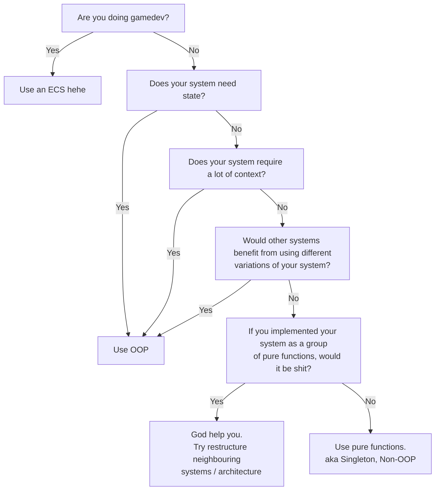

# OOP vs The Noobs
So many newbie game developers who come to [Love2d](https://love2d.org) like to shit on OOP. 
Including myself. (Yes, I was a big noob who thought I knew better) 

<!-- truncate -->

In the past, I used to be completely allergic to OOP,
but I feel like I have learned a lot more over the years, and I have mellowed out a bit.

This is my current philosophy as to where OOP is useful.

(Note, this is not to be taken too seriously)

## Behold: `SHOULD_I_USE_OOP.jpeg`

----------

 
 

Obviously this is (mostly) a joke.

For the OOP haters out there, Yes, I agree; OOP can (and will) often lead to terrible code. 
But this isn't a problem with OOP.

Also note that OOP does not mean inheritance! This is something that I misunderstood for a loooong time. 
You can have an excellent OO system without any inheritance; and in general, I think that inheritance is something that can be heavily abused.

Regardless, [the SOLID principles](https://en.wikipedia.org/wiki/SOLID) are pretty great to follow. 
The most important one (in my opinion) is the SRP. The SRP can be applied to procedural programming too; not only OOP. All the others only really make sense in an OO context, however.

