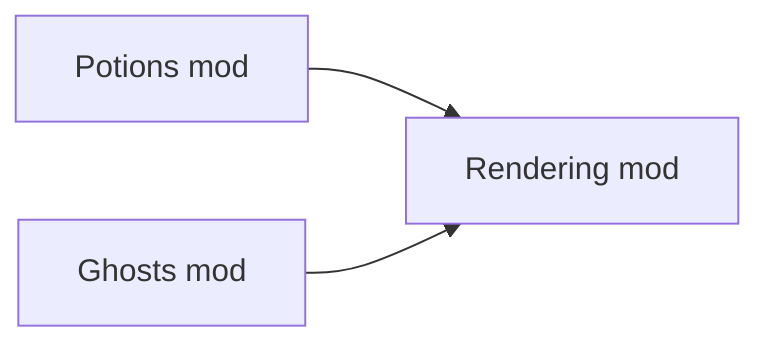
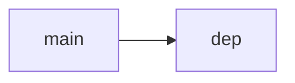

What is DELS?

<!--truncate-->

This article is heavily related (and kinda overlapping) with [these](./2023-05-10_question_buses.md) [two](./2023-06-2_umg_tech_details.md) articles.

"Delayed Structuring" or "DELS" in UMG is when we attempt to "delay" the behaviour or semantics of a system, such that future mods can change it.

For example, overriding abstract methods in OOP languages is an example of DELS.  
With abstract-methods, we are basically saying:  
"We don't know how this method could work!  
Therefore we will allow it to be overridden."

--- 

But, overriding functions in UMG is quite... "meh".  
Because only one mod can override the functions!

Regardless, I think its best to give an example:

# The problem:
The rendering-mod is in charge of rendering entities;  
So it needs to know what entities are hidden.
```lua
-- Rendering mod:
--------
local function isHidden(ent)
    ...
end
```

Lets assume we have a mod-setup like so:



In the `Potions` mod, we want an invisibility potion.  
And in the `Ghosts` mod, we want ghosts to be invisible, (unless the player has a ghost-busters item.)

(`Potions` and `Ghosts` know about `Rendering`, but `Rendering` doesn't know about either.)

This... is a problem for us.  
Because the rendering mod knows NOTHING about ghosts...  
And rendering knows NOTHING about potions either.   

And yet.. the `isHidden` check is INSIDE of the `rendering` mod!!!

Hmm.. we need to somehow *delay* the `isHidden` check to future mods.

## FEAR NOT: Behold the mighty [question bus:](./2023-05-10_question_buses.md)
```lua
-- Rendering mod:
local function isHidden(ent)
    return umg.ask("rendering:isHidden", ent)
end
```

With question-buses, 

```lua
-- Ghosts:
umg.answer("rendering:isHidden", function(ent)
    if ent.ghost and (not canSeeGhosts(playerEnt)) then
        -- player cant see ghosts!
        return true
    end
    return false
end)


-- Potions mod:
umg.answer("rendering:isHidden", function(ent)
    if ent.potions and ent.potions[INVISIBILITY] then
        -- entity is invisible!!!
        return true
    end
    return false
end)
```

This idea of "delaying" behaviour to future mods, is called "Delayed Structuring", or "DELS" for short.

## But wait!
There are 2 different values being provided here.  
How is the conflict resolved?  
Ans: We pass in a `combiner` function when we define the question. The `combiner` function is [commutative.](https://en.wikipedia.org/wiki/Commutative_property)   
In this case, we use logical-OR:
```lua
umg.defineQuestion("rendering:isHidden", OR_FUNCTION)
```
Logical-OR makes sense here.   
(Consider: If a ghost drank an invisibility potion; it should still be invisible)

## But wait! (Episode 2)
"Why not just create a `.isHidden` component in the rendering mod, and use that???"   
The issue with this ^^^ is that it creates *very fragile state*.  
What happens when the potion wears off? Do we just, set `.isHidden = false`?  
If we do that, it will probably break the ghost system!  
(Question buses are a lot better, because they are stateless.)

## But wait! (Episode 3)
"Why not create a `.isHidden` function on the entity?"  
Yes, we *COULD* create a `.isHidden` [shcomp](./2024-04-14_umg_terminology.md), and repeatedly wrap it; but that doesn't fit with the ethos of UMG, and doesn't fit with the ECS ethos either.  
Behaviour should reside in *systems*, not in components.


<br/>

---

## OKAY:
What you just read was a clear example of DELS in UMG, using question-buses.  

Although qbuses provide good DELS, they are nothing compared to *event buses.*   
Recall:  
Question bus: Gathers information. Shouldn't modify any state.   
Event bus: Dispatches information. Can/should modify state.

---

Although the above example used qbuses, *event-buses* are the ones who carry the real load in UMG;  
This is because the entire control-flow of UMG is routed through a big tree of event calls.

(Also, evbuses are quite a bit "stronger", since they are supposed to modify state, and actually transform the world.)

A great example of this is the `health-mod`:
```lua
local function killEntity(ent)
    -- kills an entity.
    --[[ HMM, other mods may want to know about this, right....? ]]
    
    ent:delete()
end
```
Here, we should absolutely be using an evbus:  
```lua

local function killEntity(ent)
    -- kills an entity.
    umg.call("health:entityDeath", ent)
    --[[
        here, we just "yeet" an event into the void.
        Maybe 10 mods will be listening!
        Maybe 0 mods are listening.
        We dont really care. The main point,
        is that we have *DELAYED* the logic for a future mod to handle.
    ]]
    
    ent:delete()
end
```

Example usage:
```lua
umg.on("health:entityDeath", function(ent)
    if ent.explosive then
        -- if entity has `explosive` component, 
        -- then we should blow up the entity
        makeExplosion(ent)
    end
end)
```

Now, the *downside*, is that this code will be called by EVERY entity that dies. So the whole setup is very elegant, but also kinda inefficient.  
That's fine though; as long as we make sure the checks are sufficiently simple.

We can do more exotic stuff too:
```lua
umg.on("health:entityDeath", function(ent)
    if ent.username and string.find(ent.username, "dave") then
        -- if entity is being controlled by a `dave`,
        -- SHAME DAVE IN ALL-CHAT! LMAO!
        chat.globalMessage("[SERVER] dave sucks at videogames")
    end
end)
```

<br/>

## When do we *need* DELS?
To clarify, DELS is just when we NEED some code/functionality in a certain place, but we want to avoid making assumptions about the said piece of code.

- We mainly need DELS in base-mods; because base-mods are highly assumptionless.


## When do we *NOT need* DELS?
We don't need DELS if we are exposing an API, as opposed to systems.  
If we can avoid needing DELS, then that is ideal.

For example, a `math` API shouldn't need DELS.  
Similarly, a random-generation library shouldn't need much DELS either.  
`typecheck` is another example of a mod that doesn't really need DELS


## Mistaking DELS for direct calls:

Imagine two mods: `game` and `dep`;   
where `dep` is a dependency of `game`:  

If `dep` needs something from `game`, then we need DELS.  
This is because `dep` knows NOTHING about `main`; it doesn't even know if whether it exists.

But if `main` needs something from `dep`, then there is no problem.  
Because `main` knows everything about `dep` anyway! There's no issue here.

<br/>
<br/>
<br/>

# *MOST IMPORTANT THING:*
# Avoiding DELS:
Often, the best course of action is avoid DELS in the first place.  
**SERIOUSLY: I CANNOT OVERSTATE THE IMPORTANCE OF THIS STATEMENT!!!**  

DELS is used when we ***NEED*** to make an assumption about the system.   
(For example; if we need to know whether an entity is hidden or not)

If we can avoid making assumptions in the first place,
then that would be the best course of action.

Please don't get into a mindset of "use DELS everywhere we can".   
This will only lead to bloat, and pain, and a slow rot of the UMG ecosystem.

### Avoiding DELS- Example:  
- "We need `ui` elements to have a size, and position within the main-scene. We can use DELS to provide our elements with size/position".

NO!! A much better solution, (IMO,) is to instead, allow future-mods to instantiate and control the main-scene themselves.   
This way, they can have full-control over the positioning/sizing of elements.  
Also, future-mods may want to have multiple main-scenes! It's way cleaner.


<br/>
<br/>


## DELS without qbuses / evbuses:
Can we do DELS without qbuses / evbuses...???

Of course we can!  
Remember; event/question buses are just *tools* that we can use to produce good DELS.  
If we want DELS without ev/q buses, we just need to invent new tools / ideas.

If you have a pattern/idea/idiom that you think could produce good DELS in the UMG ecosystem, PLEASE, **PLEASE PLEASE PLEASE** contact me on discord.  
(Discord handle: `pakeke`)

---

Thank you for reading! :)

