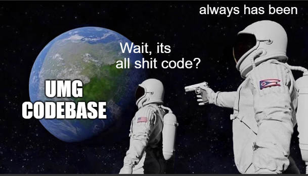
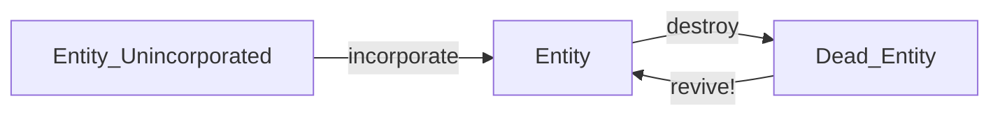
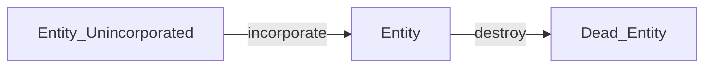

UMG is probably going to be re-written from the ground-up.  
What would it look like?

<!--truncate-->


It has come to my attention that the original version of UMG was written... pretty badly.  
I have learned a LOT as an engineer since the genesis of UMG, and I feel like the system honestly [deserves a full rewrite.](https://martinfowler.com/bliki/SacrificialArchitecture.html)

I didn't intend for this, it's mainly because I am a novice engineer, and am still learning.

<br/>



<br/>

This blog-post will essentially go over a list of things that I think should be changed/made better with the new version of UMG.

---

<br/>
<br/>

## Explicit > Implicit
The engine shouldn't do much stuff implicitly, under the hood.  

In legacy-umg, we synced entities automatically.  
We buffered entities to the ECS automatically.  
We added entities to groups automatically after creation.   
We loaded images automatically/implicitly.  
We loaded sounds automatically/implicitly.  

^^^ All of this is implicit behaviour!  
Implicit code is bad, because it can restrict what the programmers can do,
and it makes it so some code ends up being written as a "hack" around the implicit systems that exist.

It's also makes the system harder to reason about as a whole.

Next time, make stuff explicit please.


---

<br/>
<br/>


## Broader, simpler systems and APIs:

- Entities should maybe just be regular tables..? Let the modder choose the metatable.
- Entity-id syncing should be a separate system.
    - We should be able to register any table with an ID across the network.
- Entities should be added to the ECS *manually.* Buffering should be explicit.
- Make packet-definitions simple. Typed packets, no dynamic stuff.

Try to avoid any kind of "deep" APIs or abstractions.   
Keep everything broad and flat.

---

<br/>
<br/>

## Load-time validation is great
We should attempt to verify as much stuff as possible at load time.
Whether that be name-conflicts, data-integrity issues, or misuse of APIs.

Good example:  
We should have a new function: `umg.defineComponent(compName)`  
If two mods try to define the same component, we should throw an error.

Likewise, if a mod tries to define a non-existant shcomp on an entity,
then we also should throw an error

---

<br/>
<br/>

## Hybrid OO-ECS works really well.
Pure-ECS has no entity-specific behaviour. Entities cannot contain functions in pure-ECS, they can only contain data.
(This is in contrast to OOP, where functions can exist on objects, and be completely custom)  

In reality, sometimes we just *need* entity-specific shit.  
The `onActivate` function shcomp in lootplot was a complete GODSEND.  
We need more of that for future versions. It was just amazing, really.

In future, put more thought into how we can allow for better function-shcomps in the future.


---

<br/>
<br/>


## Sometimes it's best *not* to implement something, and to instead have glue-code.

Godot has a `move_and_collide()` method that you can call inside of the update-method of nodes.  
This is really beautiful, because it allows the user to completely override the movement code!  

Instead of creating some weird, bloaty abstraction (ie an overridable `.move()` method), godot just lets you call the method directly.

This is honestly amazing.  
And we should use it for syncing, and for entity-movement code too.

Having a bit of glue code is fine, especially if it avoids having an overreaching abstraction.

---

<br/>
<br/>

## Custom entity data structures
`group:onAdded(func)` was great, since allowed for custom data-structures for entities.  
More of this please. I think we can do a bit better, too.   

Encourage helper-wrappers?
```lua
function newEntityGrid(components...)
    local g = umg.group(...)
    local grid = Grid()

    g:onAdded(function(ent)
        grid:add(ent)
    end)
    g:onRemoved(function(ent)
        grid:remove(ent)
    end)

    return grid
end

local myGrid = newEntityGrid("fire", "burnable")
```
More importantly, tho, we should aim to provide better features to enable this sort of flexible programming.  
Maybe something to do with archetypes in the future?


---

<br/>
<br/>
<br/>


---

## Things that worked well for UMG:

- `sync.proxyEventToClient` this was amazing, simple, and super helpful
- `sync.autoSyncComponent` for simple components, this was amazing
- `typecheck` mod was DAMN AWESOME.
- `umg.exists` was really great
- `onActivate` component (and in general, function shcomps) were great
- wrapping `umg.defineEntityType` was super cool. (eg `defineFood`)
- Querying across entities in a global-ish fashion was very elegant. 

---

<br/>
<br/>

## Events:
- evbuses, qbuses were pretty good (kinda)

I was a bit unhappy with how events/questions were defined.
I would like strong-type-lints in the next version, maybe.  
Something like:
```lua
local call, on = Event()

call(1,2,3)

on(function(x,y,z)
    print("explosion!")
end)
```
^^^ this would allow LuaLS to work.  
Not only that, but we could also do stuff like:
```lua
local call, on = Event()
proxyEventToClient(call, on, "mod:event_id")
```

---

<br/>
<br/>


## Lets talk about "flexibility."
When I started, a core goal of UMG was "flexibility".  
I changed my mind on this, and now, I think that a more practical goal is to have high cohesion between mods instead.  

When writing code, you can never write code that accounts for everyone's use case. That's just not realistic.  
I often found that, whilst trying to aim for great-flexibility, I would just end up making premature abstractions that ended up adding useless complexity to the system.  
"Oh, but it's flexible! Oh wow, it's so generic!!!"  
No. Shut up!  
We don't want complex abstractions. The more abstract something is, the harder it is to work with in a practical sense.

A much better goal, is to prioritize making good, simple assumptions about stuff instead.  

In general, our goal should be to create hard, well-defined *assumptions* about systems, rather than trying to shoehorn in a one-size-fits-all approach that just ends up getting nowhere, and doing nothing useful.

The new goal for UMG is to create maximum *cohesion* between mods.  
If modder-A and modder-B write mods, then both mods should ideally work with each other just fine.

---

<br/>
<br/>


## Hard limitations are good

At face value, limitations sound objectively bad.  
But, like with many things, there is always nuance:

If a system has more limitations, then we can reason about it more effectively.  
Simple example: `foo variable is a number`  
^^^ This is a big limitation. But this "limitation" gives us great value.  
What value do we get? Lets see!
```
[foo is a number]
- we can add,subtract,multiply,divide by foo
- we can plug it into functions
- we can set the value of it robustly
- DOWNSIDE: we cant represent more exotic types in foo

[foo is any type]
- It's flexible
- DOWNSIDE: We lose ALL of the above benefits
```
This is a kinda weird/contrived example, but it demonstrates the idea.  
Limitations can be good, when chosen well!! It's all about *execution.*

- Good limitation, is *very good*.
- Bad limitation, is VERY, VERY BAD.

**EXAMPLE: Revival vs NO Revival of entities:**



At a glance, it may seem like these two setups are pretty much identical.  

BUT **NO!!!** The second one has a hard limitation: "Dead entities will NEVER be revived."  
This limitation gives us *so much more power.*  

Systems that receive a dead-entity can be 100% sure that it will never exist again. So, they can dispose of it happily.  
The server doesn't need to worry about syncing, and systems that have a hold on the entity-id can happily recycle the ent-id for other stuff.

---

Another example:  
In minecraft, you can only have 1 block per (x,y,z) position.  
(IE, you cannot have blocks that are placed inbetween other blocks)   
This sounds bad, but it's not. It's actually very good!  
If there are more limitations, then our code can reason about stuff better:
- There don't need to be as many safety checks
- Our systems can be more sure of things
- We can make more powerful/strong assumptions

And best of all, the one-block per (x,y,z) position fits really well with the game; in fact, it even defines *what the game is.*

---

**TO SUM IT UP:**  
Limitations can often provide good value.  
What's really important is choosing the *right* limitations, and not putting limits on stuff if there is no clear gain.

---

<br/>
<br/>

## Entity Archetypes

Entity [Archetypes](https://ajmmertens.medium.com/building-an-ecs-2-archetypes-and-vectorization-fe21690805f9) are a fantastic idea.  
Obviously, UMG won't get the cache-benefits of them; but we will definitely get the efficiency and design benefits.  

In general, a UMG Archetype will just be a data structure that represents a Set of components, and stores entities.  
Instead of storing entities in groups; groups will store archetypes. Archetypes will store entities.

Likewise, instead of having logical-AND for group-ownership, what about having functions with signature: `fun(arc: Archetype) -> bool` that determines whether the entity archetype should be accepted?
```lua
local group = Group(function(archetype)
    return archetype:hasComponent("x") and archetype:hasComponent("y")
end)

-- same as:
local group = Group(withComponents({"x", "y"}))

-- (with the legacy systems:)
local group = umg.group("x", "y")
```

(Be wary, though! Archetypes **NEED** to be lazily created, or else, with 100 components, we would have 2^100 archetypes!  
*In general, there should NEVER be more archetypes than entity-types.*)

We can also use archetypes for other exotic purposes.

---

<br/>
<br/>


## Smart event/question buses:

```lua
on(function (ent)
  if ent.comp and ent.c2 then
    func(ent)
  end
end)

-- equivalent to :

smartOn({"comp", "c2"}, func)
```

When emitting an event with entity as first argument, instead of looping all listeners,  we can use the archetype of the entity to do an O(1) lookup to get  all of the listeners that will respond to this entity.

#### ISSUE WITH THIS OPTIMIZATION:
We need to store a list of functions inside each archetype, for each event. EG:
```lua
archetype.eventListeners = {  [eventName] = {f1, f2, f3 ... } }
```
This… is quite cache inefficient. HOWEVER, we can fix this by sharing function lists:

A lot of the time, function lists will be the same across archetypes. (eg. imagine a list of event-listeners that dont require ANY components.  Each archetype would contain the exact same functions for that event!!)

We can optimize, then, by sharing identical lists across archetypes. This makes caching slightly better, and more efficient.

In order to discover what lists are identical, we should use bitset data-structure; (the same one we use to compare components in archetypes and groups)  
Each position in the bitset references an event method.  
Whereas with archetypes/entities, each position in the bitset refers to a component-string.

