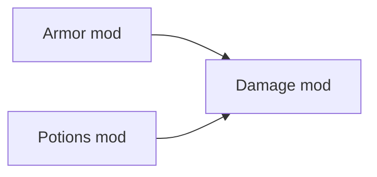

What is DELS?

<!--truncate-->

This article is heavily related (and kinda overlapping) with [these](./2023-05-10_question_buses.md) [two](./2023-06-2_umg_tech_details.md) articles.

"Delayed Structuring" or "DELS" in UMG is when we attempt to "delay" the behaviour or semantics of a system, such that future mods can change it.

For example, overriding abstract methods in OOP languages is an example of DELS.  
With abstract-methods, we are basically saying:  
"We don't know how this method could work!   
Therefore we will allow it to be overridden."

--- 

But, overriding functions in UMG is quite... "meh". 
Because only one mod can override the functions!

Take for example, the rendering-mod.  
The rendering-mod is in charge of rendering entities.  
However, some entities may be hidden...
```lua
-- Rendering mod:
--------
local function isHidden(ent)
    ... --hmm, what do we put here?
end
```

And lets assume we have a mod-setup like so:


The `Armor`-mod and the `Potions`-mod knows about the `Damage`-mod,
but the `Damage`-mod doesn't know about either.

Hmm.. we need to somehow *delay* the damage mechanism to a future mod.

FEAR NOT: We can solve this issue with [question buses:](./2023-05-10_question_buses.md)
```lua
local function getDamageMultiplier(ent, damageAmount)
    return umg.ask("damage:getDamageMultiplier", ent, damageAmount) or 1
end
```

From there, we can respond to the question in the Armor and Potions mods, and provide an appropriate answer:

```lua
-- Armor:
umg.answer("damage:getDamageMultiplier", function(ent)
    if ent.armor then
        return ent.armor.resistance
    end
    return 1
end)


-- Potions mod:
umg.answer("damage:getDamageMultiplier", function(ent)
    if ent.potions and ent.potions[RESISTANCE] then
        return 1 / getPotency(ent.potions[RESISTANCE])
    end
    return 1
end)
```
BUT HANG ON!!!   
There are 2 different values being provided here.  
How is the conflict resolved?  
Ans: We pass in a `combiner` function when we define the question. The `combiner` function is [commutative.](https://en.wikipedia.org/wiki/Commutative_property)   
In this case, we use multiplication:
```lua
umg.defineQuestion("damage:getDamageMultiplier", MULTIPLICATION)
```


### *Quick disclaimer:*
We *COULD* create a `.isHidden` function on the entity; (shcomp), and repeatedly wrap it; but that doesn't fit with the ethos of UMG, and doesn't fit with the ECS ethos either.  
Behaviour should reside in *systems*, not in components.


<br/>

---

## OKAY:
This is a clear example of "Delayed Structuring", or "DELS".  
This sort of idiom is very important in UMG, since it allows mods to cooperate, and communicate with each other without getting in the way.

But, perhaps a better example, is *event buses.*   
Question bus: Gathers information. Shouldn't modify any state.
Event bus: Dispatches information. Can/should modify state.

---

Although the above example used question-buses, *event-buses* are the ones who carry the real load in UMG;  
This is because the entire control-flow of UMG is routed through a big tree of event calls.

(Also, evbuses are quite a bit "stronger", since they are supposed to modify state, and actually transform the world.)

A great example of this is the `health-mod`:
```lua
local function killEntity(ent)
    -- kills an entity.
    --[[ HMM, other mods may want to know about this, right....? ]]
    
    ent:delete()
end
```
Here, we should absolutely be using an event-bus:  
```lua

local function killEntity(ent)
    -- kills an entity.
    umg.call("health:entityDeath", ent)
    --[[
        here, we just "yeet" an event into the void.
        Maybe 10 mods will be listening!
        Maybe 0 mods are listening.
        We dont really care. The main point,
        is that we have *DELAYED* the logic for a future mod to handle.
    ]]
    
    ent:delete()
end
```


## When do we *need* DELS?
To clarify, DELS is just when we NEED some code/functionality in a certain place, but we want to avoid making assumptions about the said piece of code.

- We mainly need DELS in base-mods; because base-mods are highly assumptionless.


## When do we *NOT need* DELS?
We don't need DELS if we are exposing an API, as opposed to systems.  
If we can avoid needing DELS, then that is best


## DELS without qbuses / evbuses:
Can we do DELS without qbuses / evbuses...???

Of course we can!  
Remember; event/question buses are just *tools* that we can use to produce good DELS.  
If we want DELS without ev/q buses, we just need to invent new tools / ideas.


